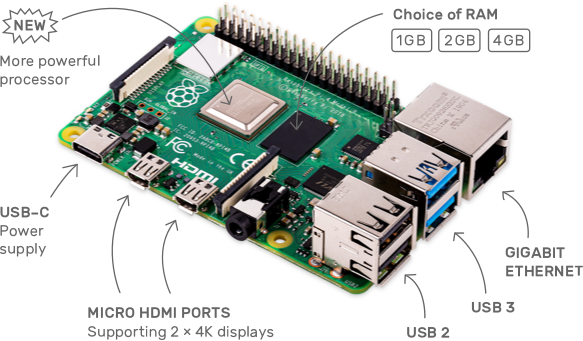

## Partes requeridas

### Hardware requerido
- Raspberry Pi 4 con 8 GB de RAM
- Tarjeta microSD de 32 GB o más con adaptador
- Adaptador de alimentación de 5V/3A y cable USB-C
- Disco duro externo de 1 TB o más

